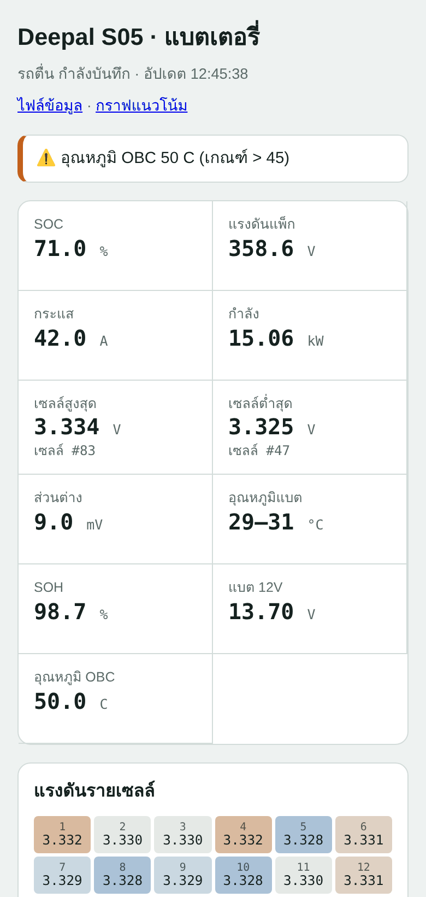
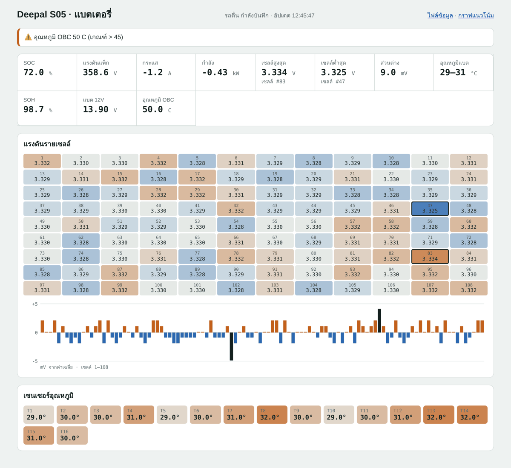
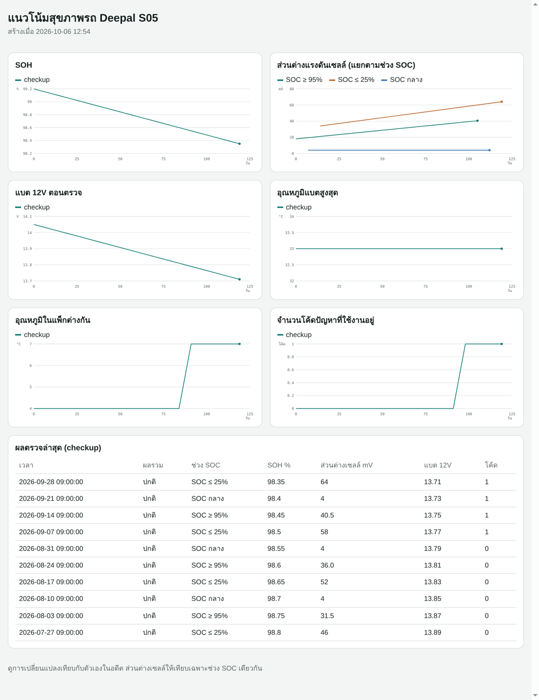
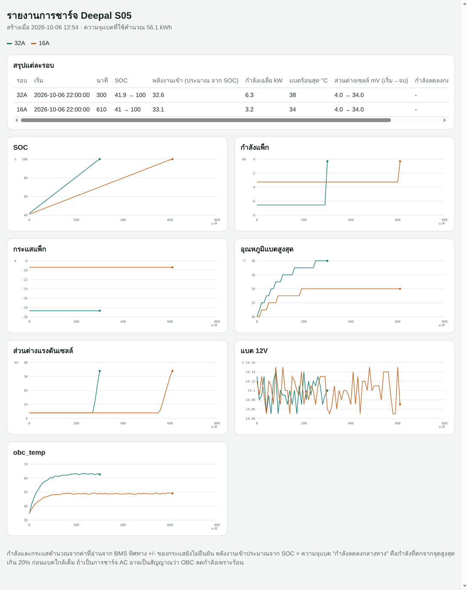

<h1 align="center">Deepal S05 OBD</h1>

<p align="center">
  เฝ้าดูสุขภาพแบตเตอรี่และระบบของ <b>Deepal S05</b> ด้วยกล่อง ELM327 ราคาพันกว่าบาท<br>
  รู้สัญญาณก่อนพัง โดยไม่ต้องซื้อเครื่องสแกนหลักหมื่น · <b>อ่านอย่างเดียว ไม่เขียนค่าใดๆ ลงรถ</b>
</p>

<p align="center">
  <a href="https://github.com/naruenatthi-ship-it/OBD/actions/workflows/tests.yml"></a>
  
  
  <a href="LICENSE"></a>
</p>

<table align="center">
  <tr>
    <td></td>
    <td></td>
  </tr>
</table>
<p align="center"><sub>หน้า dashboard บน iPhone และคอม (ภาพจากตัวจำลอง ตัวเลขไม่ใช่ค่าจากรถจริง)</sub></p>

> [!IMPORTANT]
> **สถานะ: เบต้า** ค่าแบตหลักมาจากข้อมูลที่ชุมชนแกะไว้จาก S05 ต่างประเทศ
> โปรแกรมทดสอบกับตัวจำลองครบแล้ว แต่**ยังไม่ได้ยืนยันกับรถสเปกไทย**
> ถ้าลองแล้วได้ผลอย่างไร ช่วยแจ้งใน [Issues](../../issues) ได้เลย

## ทำอะไรได้บ้าง

| | |
|---|---|
| 🔋 **ดูแบตแบบสด** | SOC, แรงดัน/กระแส/กำลัง, เซลล์สูงสุด/ต่ำสุด (บอกเลขเซลล์), อุณหภูมิแบต, SOH, แบต 12V |
| 📱 **หน้าจอบนมือถือ** | dashboard ในเบราว์เซอร์ ดูจาก iPhone ผ่าน Hotspot ได้ พร้อมแผนผังแรงดันรายเซลล์ (เมื่อแกะค่าได้) |
| 🩺 **ตรวจรถรายสัปดาห์** | `checkup` รวมค่าแบต แบต 12V และโค้ดปัญหาทุกกล่อง เทียบกับครั้งก่อน แล้วสรุปเป็น ✅ / ⚠️ / 🔴 |
| 📈 **ดูแนวโน้มระยะยาว** | กราฟ SOH, ส่วนต่างเซลล์, แบต 12V, อุณหภูมิ, IR ของแพ็ก ช่วยเห็นสิ่งที่ค่อยๆ แย่ลง |
| 🔔 **แจ้งเตือนเข้ามือถือ** | แบตร้อน, แบต 12V ต่ำ, หัวชาร์จร้อน, เซลล์ไม่สมดุล, โค้ดปัญหาใหม่ ผ่านแอป [ntfy](https://ntfy.sh) (ฟรี) |
| ⚡ **ชาร์จและบาลานซ์** | บันทึกระหว่างชาร์จ จับสัญญาณ OBC ลดกำลังเพราะร้อน เทียบชาร์จ 32A กับ 16A และเฝ้าดูการบาลานซ์ตอนเต็ม |
| 🚗 **ทดสอบขับซ้ำ** | `drivetest` เร่งหรือขับเส้นทางเดิม แล้วเทียบกำลังสูงสุด แรงดันตก และ IR กับเดือนก่อน |
| 🔧 **อ่านโค้ดปัญหา** | อ่านจากทุกกล่อง ECU บอกสถานะ และเทียบกับการสแกนครั้งก่อน (ไม่ลบโค้ด) |
| 🧪 **แกะค่าใหม่เอง** | `ecus`, `discover`, `scandiff`, `record`, `correlate` ช่วยหาค่าที่ยังไม่มีใครเผยแพร่ ทำเองที่บ้านได้ |
| 🍓 **Raspberry Pi ในรถ** | ติดไว้ถาวร บันทึกเองทุกครั้งที่รถติด ไม่ส่งอะไรเข้ารถตอนรถหลับ |

<p align="center">
  
  
</p>

## อุปกรณ์ที่ต้องใช้

| อุปกรณ์ | หมายเหตุ |
|---|---|
| **กล่อง ELM327 ที่ดี** | แนะนำ **Vgate vLinker MC+** (บลูทูธ 3.0+4.0 ใช้ได้ทั้ง iPhone, Android, Windows) กล่องโคลนราคาถูกมากมักใช้กับรถรุ่นนี้ไม่ได้ |
| **คอมพิวเตอร์** อย่างใดอย่างหนึ่ง | โน้ตบุ๊ก/คอม Windows, Linux หรือ macOS ที่มี Python 3.8+ **หรือ** Raspberry Pi Zero 2 W ติดในรถ ([วิธีติดตั้ง](pi/README.md)) |
| iPhone/Android (ไม่บังคับ) | ดู dashboard และรับแจ้งเตือน |

## เริ่มใช้งาน

```bash
pip install -r requirements.txt

# 1) ตรวจว่ารถตอบไหม (รถต้อง READY)
python -m deepal_s05 --port COM5 check

# 2) หน้าจอสดในเบราว์เซอร์ (เปิด http://localhost:8000)
python -m deepal_s05 --port COM5 dashboard

# 3) ตรวจรถประจำสัปดาห์
python -m deepal_s05 --port COM5 checkup
```

`--port` คือพอร์ตของกล่อง: `COM5` (บลูทูธ/USB บน Windows), `/dev/rfcomm0`, `rfcomm://AA:BB:CC:DD:EE:FF`
(บลูทูธบน Linux/Pi) หรือ `socket://192.168.0.10:35000` (กล่อง WiFi)

**ยังไม่มีรถหรือกล่อง?** ลองกับตัวจำลองได้:

```bash
pip install ELM327-emulator
python emulator/run_emulator.py
python -m deepal_s05 --port socket://localhost:35000 --signals examples/signals_demo.json dashboard
```

## คำสั่งทั้งหมด

| กลุ่ม | คำสั่ง |
|---|---|
| ดูค่า | `check` · `live` · `dashboard` |
| สุขภาพรถ | `checkup` · `trends` · `health` · `drivetest` · `dtc` · `aux12v` |
| ชาร์จ | `charge` · `balance` · `report` |
| Raspberry Pi | `autopilot` |
| แกะค่าใหม่ | `ecus` · `discover` · `scandiff` · `record` · `correlate` · `sniff` · `analyze` |

รายละเอียดทุกคำสั่ง ตัวเลือก และเกณฑ์แจ้งเตือน: **[คู่มือการใช้งานฉบับเต็ม](docs/USAGE.md)**

## ค่าที่อ่านได้ตอนนี้

ECU แบตเตอรี่ (BMS) header `7A1` → ตอบที่ `7A9`, UDS service `0x22`

| ค่า | DID | สูตร | สถานะ |
|---|---|---|---|
| SOC | `F22F` | `A` | ✅ ยืนยันแล้ว (รถต่างประเทศ) |
| แรงดันแพ็ก | `F228` | `(A*256+B)/10` V | ✅ |
| กระแสแพ็ก | `F229` | `((A*256+B)-6015)/10` A | ✅ |
| แรงดันเซลล์สูงสุด / ต่ำสุด | `F250` / `F251` | `(A*256+B)/1000` V | ✅ |
| อุณหภูมิแบตสูงสุด / ต่ำสุด | `F252` / `F253` | `A-40` °C | ✅ |
| อุณหภูมิหัวชาร์จ | `F255` | `(A-32)/1.8` °C | 🟡 รอยืนยัน |
| SOH | `F27D` | `(A*65536+B*256+C)/10000` % | 🟡 รอยืนยัน |

**ยังไม่มีใครเผยแพร่:** แรงดันรายเซลล์, อุณหภูมิมอเตอร์/IPU/OBC, น้ำหล่อเย็น, ค่าฉนวน
ช่วยกันแกะได้ด้วย [คู่มือวันแกะข้อมูล](REVERSE.md) แล้วส่งผลผ่าน [Issues](../../issues/new/choose)
ค่าที่แกะได้ใส่ในไฟล์ `--signals` ได้ทันทีโดยไม่ต้องแก้โค้ด

## ความปลอดภัย

- โค้ดยอมส่งเฉพาะคำสั่งอ่าน: `22` (อ่านค่า), `19 02` (อ่านโค้ดปัญหา), `10 01/03` (สลับโหมดวินิจฉัย), `3E 00`
  คำสั่งเขียนค่า ลบโค้ด รีเซ็ต ปลดล็อก หรือสั่งงาน **ถูกปฏิเสธในโค้ด** และมีชุดทดสอบตรวจเรื่องนี้
- โหมด Raspberry Pi ไม่ส่งข้อความเข้ารถตอนรถหลับ จะได้ไม่ไปปลุกรถจนแบต 12V หมด
- ไฟล์ที่บันทึกจาก `discover`/`record` ตัดเลข VIN และ serial ออกให้อัตโนมัติ ก่อนแชร์ไฟล์

## แผนงาน

- [x] อ่านค่าแบตหลัก, dashboard, แจ้งเตือน, checkup, trends, ชาร์จ/บาลานซ์, drivetest
- [x] อ่านโค้ดปัญหาและเทียบกับครั้งก่อน
- [x] เครื่องมือแกะค่าใหม่ และโหมด Raspberry Pi
- [ ] ยืนยันค่าแบตหลักกับ S05 สเปกไทย (56.1 / 68.82 kWh)
- [ ] แกะแรงดันและอุณหภูมิรายเซลล์
- [ ] อุณหภูมิมอเตอร์, IPU, OBC และน้ำหล่อเย็น
- [ ] ค่าความต้านทานฉนวนระบบไฟแรงสูง
- [ ] ตั้งเกณฑ์แจ้งเตือนจากข้อมูลรถจริงหลายคัน

## ขอบคุณ

- [jpires71/Deepal_S05_PIDs](https://github.com/jpires71/Deepal_S05_PIDs) ผู้แกะและยืนยันค่าแบตชุดแรกของ S05
- [Ircama/ELM327-emulator](https://github.com/Ircama/ELM327-emulator) ใช้เป็นตัวจำลองสำหรับทดสอบ

## ข้อจำกัดความรับผิดชอบ

โปรเจกต์นี้ทำโดยผู้ใช้รถ **ไม่เกี่ยวข้องกับ Deepal, Changan หรือตัวแทนจำหน่าย**
ชื่อและเครื่องหมายการค้าเป็นของเจ้าของ ค่าที่อ่านได้เป็นค่าที่ชุมชนแกะเอง อาจไม่ตรงกับค่าจริง
ใช้เพื่อเฝ้าดูและประกอบการตัดสินใจเท่านั้น ไม่ใช่การวินิจฉัยของช่างผู้เชี่ยวชาญ การใช้งานเป็นความเสี่ยงของผู้ใช้เอง

---

## English summary

Read-only monitoring of the **Deepal S05** (Changan) through a cheap ELM327 adapter: live battery
data (SOC, pack voltage/current, min/max cell voltage, temperatures, SOH, 12 V), a phone-friendly
dashboard, weekly health checkups with history and trend charts, push alerts via ntfy, charge and
balancing logs, repeatable drive tests, trouble code reading with diffs, tools for reverse
engineering unknown DIDs at home, and an unattended Raspberry Pi mode that never wakes a sleeping
car. Only read-type UDS requests are ever sent. Battery DIDs come from
[jpires71/Deepal_S05_PIDs](https://github.com/jpires71/Deepal_S05_PIDs); not yet verified on
Thai-market cars. Docs are in Thai; issues in English are welcome.

## License

[MIT](LICENSE)
